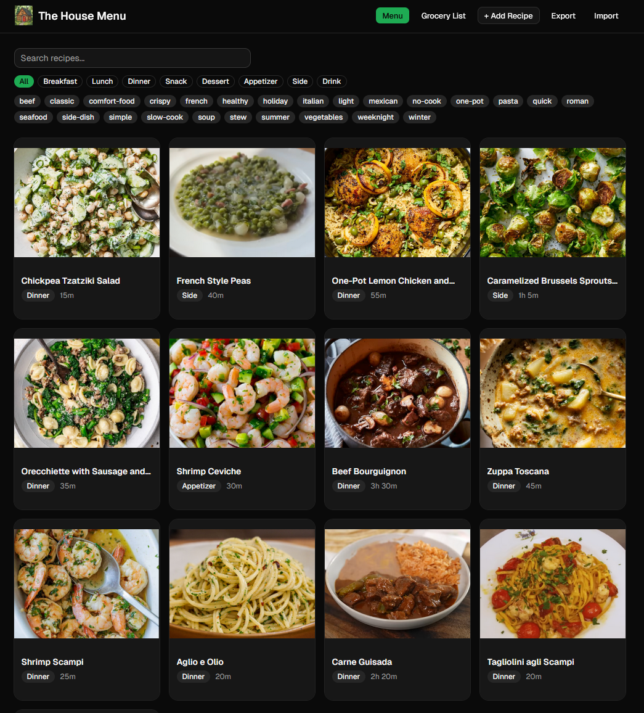

# The House Menu

A personal recipe manager and grocery list generator. Save your favorite recipes, upload images, and generate grocery lists.



## Features

- **Recipe Management** — Create, edit, and delete recipes with ingredients, step-by-step instructions, prep/cook times, servings, tags, and images
- **Search & Filter** — Find recipes by name, filter by meal category (breakfast, lunch, dinner, etc.), or narrow down by tags
- **Image Support** — Upload recipe photos that are automatically compressed and stored locally
- **Grocery List Generator** — Select multiple recipes and generate a combined grocery list with ingredients aggregated, units converted, and items grouped by grocery aisle
- **Export / Import** — Export your recipes as a JSON file, import them on any device. Your data is yours
- **Dark Mode** — Full light and dark theme support

## Live Demo

**[https://tawhetsell.github.io/the-house-menu/](https://tawhetsell.github.io/the-house-menu/)**

The hosted site is read-only at this time. Currently, you can browse existing recipes, search, filter, and view grocery lists, but you cannot add, edit, or delete recipes. All the editing and management features require running the app locally.

## Running Locally

To get the full experience with recipe editing, image uploads, and data export/import:

```bash
npm install
npm run dev
```

The dev server runs at `http://127.0.0.1:3000`. On Windows, you can also use `dev.bat`.

Recipes are seeded from `public/data/recipes.json` into IndexedDB on first load. To persist your changes:

1. Add or edit recipes in the app
2. Click **Export** to download your updated `recipes.json`
3. Replace `public/data/recipes.json` with the exported file

## Built With

- React 19, TypeScript, Vite
- Dexie (IndexedDB) for local storage
- Tailwind CSS + Base UI for styling
- Zustand for UI state
- React Hook Form + Zod for validation
